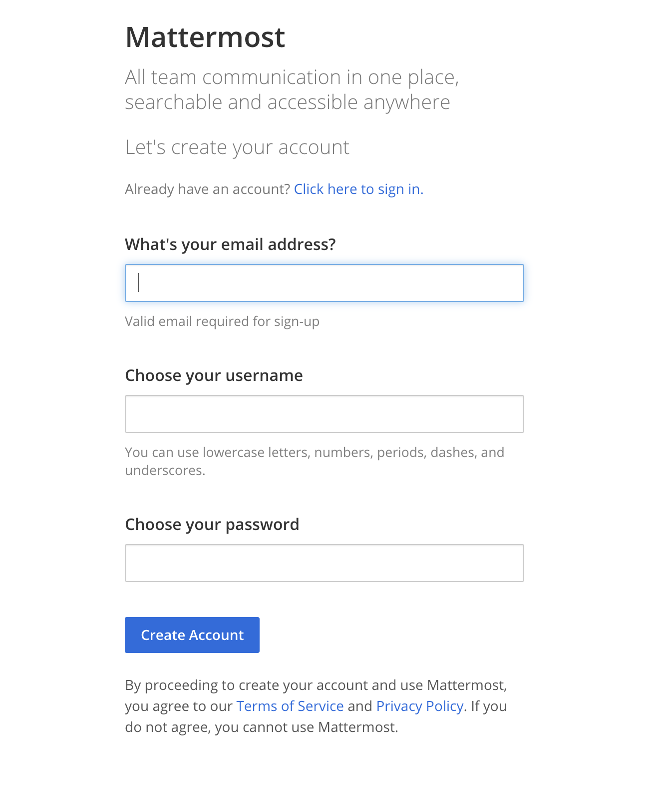

# Mattermost 설치 및 운영하기

Slack의 강력한 대체제로 불리는 Mattermost는 온프레미스 환경에서 설치하여 운영할 수 있는 오픈소스 팀 채팅 프로그램이다. 다른 오프소스 채팅 프로그램으로서 [Rocket.Chat](https://rocket.chat/)과 [Zulip](https://zulipchat.com/)이 있으나 Mattermost는 기업에서 사용할 수 있도록 최적화된 팀 기반 채팅 프로그램이라고 할 수 있다.


대표적으로 삼성, 미국 사회보장국, 우버에 이르기까지 각종 정부기관과 금융기간까지 사용하기 때문에 팀 기반의 개발 업무 프로세스에 있어서 어떠한 플랫폼을 결정을 고민 중이라면 Mattermost을 선택하는 방안도 적극 검토할 필요가 있다.

정부나 기업에서 Mattermost를 선택하는 이유는 보안에 대한 이유를 들 수 있다. Slack의 경우 온프레미스 환경에 설치하지 않고 바로 사용할 수 있다는 장점이 있으나, 민감한 데이터들이 외부에 저장하지만 Mattermost는 사내 기업에 대화 내용이 보관되기 때문에 보안시스템이 잘 갖추어진 환경에서는 기업의 대화 내용 및 개발 환경에 대해 안전하게 보관할 수 있을 것이다.

웹 페이지뿐만 아니라 IOS, Android, Mac OS, Windows, Linux 클라이언트 프로그램을 제공하기 때문에 운영의 제약이 거의 없는 것도 매리트로 다가올 것이다.

Mattermost의 자세한 내용은 [Mattermost 홈페이지](https://mattermost.com/)를 참고하여 기능과 가격 정책에 대해 알아보면 좋을 것이다.

### Mattermost install

Mattermost는 온프레미스 환경에서 설치하기 때문에 반드시 서버가 있어야 한다. 일반적인 설치방법이 다소 복잡할 수 있으나 Docker를 활용해 설치한다면 간단하게 설치할 수 있다.

```
$ git clone https://github.com/mattermost/mattermost-docker.git
```

git clone을 통해 docker 설치 파일을 다운로드하고 docker-compose.yml을 살펴본다.

```
version: "2"

services:

  db:
    build: db
    read_only: true
    restart: unless-stopped
    volumes:
      - ./volumes/db/var/lib/postgresql/data:/var/lib/postgresql/data
      - /etc/localtime:/etc/localtime:ro
    environment:
      - POSTGRES_USER=mmuser
      - POSTGRES_PASSWORD=mmuser_password
      - POSTGRES_DB=mattermost
    # uncomment the following to enable backup
    #  - AWS_ACCESS_KEY_ID=XXXX
    #  - AWS_SECRET_ACCESS_KEY=XXXX
    #  - WALE_S3_PREFIX=s3://BUCKET_NAME/PATH
    #  - AWS_REGION=us-east-1

  app:
    build:
      context: app
      # uncomment following lines for team edition or change UID/GID
      # args:
      #   - edition=team
      #   - PUID=1000
      #   - PGID=1000
    restart: unless-stopped
    volumes:
      - ./volumes/app/mattermost/config:/mattermost/config:rw
      - ./volumes/app/mattermost/data:/mattermost/data:rw
      - ./volumes/app/mattermost/logs:/mattermost/logs:rw
      - ./volumes/app/mattermost/plugins:/mattermost/plugins:rw
      - ./volumes/app/mattermost/client-plugins:/mattermost/client/plugins:rw
      - /etc/localtime:/etc/localtime:ro
    environment:
      # set same as db credentials and dbname
      - MM_USERNAME=mmuser
      - MM_PASSWORD=mmuser_password
      - MM_DBNAME=mattermost
      # in case your config is not in default location
      #- MM_CONFIG=/mattermost/config/config.json

  web:
    build: web
    ports:
      - "80:80"
      - "443:443"
    read_only: true
    restart: unless-stopped
    volumes:
      # This directory must have cert files if you want to enable SSL
      - ./volumes/web/cert:/cert:ro
      - /etc/localtime:/etc/localtime:ro
    # Uncomment for SSL
    # environment:
    #  - MATTERMOST_ENABLE_SSL=true
```

기본 상태로 설치를 진행해도 무리 없이 사용이 가능하지만, 사용 환경에 맞게 다음 변수를 적절하게 변경하여 설치하는 것을 추천한다.


1.  Mattermost 데이터베이스 설정

-   매개변수
  
    -   POSTGRES\_USER : database username
    -   POSTGRES\_PASSWORD : 데이터베이스 비밀번호
    -   POSTGRES\_DB : database name
    -   MM\_USERNAME : database username
    -   MM\_PASSWORD : database password
    -   MM\_DBNAME : database name

2.  Mattermost를 AWS에 설치하고 싶다면 현재 주석처리되어있는 다음 항목에 정보를 입력하면 된다.

-   매개변수
    -   AWS\_ACCESS\_KEY\_ID : AWS access key
    -   AWS\_SECRET\_ACCESS\_KEY : AWS secret
    -   WALE\_S3\_PREFIX : AWS s3 bucket name
    -   AWS\_REGION : AWS region
    
    

#### docker-compose을 황용하여 설치

시작하기 위해서 필수 디렉터리와 소유자 정보를 설정해야 한다.

```
$ cd mattermost-docker
$ mkdir -p ./volumes/app/mattermost/{data,logs,config,plugins}
$ chown -R 2000:2000 ./volumes/app/mattermost/
$ docker-compose build && docker-compose up -d
```

위와 같이 실행하면 관련 Docker 파일 설치가 시작된다. 이때 해당 서버의 80, 443 포트가 사용하지 않아야 한다. 설치 시간은 서버의 스펙이나 네트워크 환경에 따라 다르겠지만 보통 10분 정도가 소요된다.

필자는 ESXi VM, Ubuntu 18.04.3 LTS에서 설치를 진행하였다.

#### 초기 세팅



설치 이후 웹 브라우저를 통해 해당 서버로 접속하여 위 그림과 같이 접속이 된다면 설치는 완료된 것이다. 이후 계정을 생성하고 System Console로 접속한다.


#### Reverse Proxy 설정

대부분의 환경에서 해당 서버를 공인 IP로 노출시키는 일은 거의 없기 때문에 reverse proxy 설정을 진행하도록 한다.

Mattermost는 웹 소켓을 사용하기 때문에 reverse proxy에서 반드시 이에 관련된 설정을 진행하여야 한다. Apache2 reverse proxy 설정 파일은 다음과 같다. SSL 인증서는 Let's Encrypte를 사용했다.

```
<VirtualHost *:80>
  ServerName $(server domain)
  ServerAdmin contact@contact.com

  AllowEncodedSlashes On

  RewriteEngine On
  RewriteCond %{HTTPS} off
  RewriteRule (.*) https://%{HTTP_HOST}%{REQUEST_URI}

  ErrorLog ${APACHE_LOG_DIR}/mattermost-error.log
  CustomLog ${APACHE_LOG_DIR}/mattermost-access.log combined
  RewriteCond %{SERVER_NAME} =$(server domain)
  RewriteRule ^/?(.*) https://%{SERVER_NAME}/$1 [R,L]
</VirtualHost>

<VirtualHost *:443>
  ServerName $(server domain)
  ServerAdmin contact@contact.com

  ProxyRequests Off
  SSLProxyEngine on

  ProxyPreserveHost On
  AllowEncodedSlashes On

  <Proxy *>
    Order deny,allow
    Allow from all
  </Proxy>

  SSLEngine on
  SSLProxyVerify none
  SSLProxyCheckPeerCN off
  SSLProxyCheckPeerName off
  SSLProxyCheckPeerExpire off

  RewriteEngine On
  RewriteCond %{REQUEST_URI} ^/api/v[0-9]+/(users/)?websocket [NC,OR]
  RewriteCond %{HTTP:UPGRADE} ^WebSocket$ [NC,OR]
  RewriteCond %{HTTP:CONNECTION} ^Upgrade$ [NC]
  RewriteRule .* ws://$(server ip:port)%{REQUEST_URI} [P,QSA,L]
  RewriteCond %{DOCUMENT_ROOT}/%{REQUEST_FILENAME} !-f
  RewriteRule .* http://$(server ip:port)%{REQUEST_URI} [P,QSA,L]
  RequestHeader set X-Forwarded-Proto "https"

  RequestHeader unset If-Modified-Since
  RequestHeader unset If-None-Match

  <LocationMatch "/api/(?<version>v[0-9]+)/(?<users>users/)?websocket$">
     Require all granted
     ProxyPassReverse ws://$(server ip:port)/api/v%{env:MATCH_VERSION}/%{env:MATCH_USERS}websocket
     ProxyPassReverseCookieDomain $(server ip:port) $(server domain)
  </LocationMatch>

  ProxyPass / https://$(server ip:port)/ nocanon
  ProxyPassReverse / https://$(server ip:port)/

  RequestHeader set X-Forwarded-Proto "https"
  RequestHeader set X-Forwarded-Port "443"
  ProxyPreserveHost On
  ProxyRequests Off

  ErrorLog ${APACHE_LOG_DIR}/mattermost-error.log
  CustomLog ${APACHE_LOG_DIR}/mattermost-access.log combined
  SSLCertificateFile /etc/letsencrypt/live/$(server domain)/fullchain.pem
  SSLCertificateKeyFile /etc/letsencrypt/live/$(server domain)/privkey.pem
  Include /etc/letsencrypt/options-ssl-apache.conf

</VirtualHost>
```

-   $(server domain) : 서버의 도메인
  
-   $(server ip:port) : mattermost가 설치된 서버의 IP와 포트
  
    -   (위 방법으로 설치 시 80/443 포트가 사용됨으로 포트 생략 가능)
    
    

#### Mattermost AntivirusPlugin

Mattermost 설치 후 채팅 시 바이러스가 걱정된다면 clamav 안티 바이러스 프로그램을 통해 일부 해소할 수 있다.

-   Docker를 통해 안티바이러스 프로그램을 설치한다.
  
    ```
    $ docker run -d -p 3310:3310 mkodockx/docker-clamav
    ```
    
-   **System Console > Plugins > Plugin Management** 이동하여 **Antivirus**를 enable로 설정한다.
  
-   **ClamAV - Host and Port**으로 이동하여 설치된 안티바이러스가 설치된 IP와 포트번호를 입력한다.
  
    -   기본 설정 포트는 docker로도 알 수 있듯이 3310이다.
    
    

#### SMTP 설정

Mattermost는 이메일을 통해서 사용자 가입이나, 초대 링크를 전송할 수 있기 때문에 SMTP 설정을 진행한다.

-   **System Console > SMTP** 설정으로 이동한다.
    -   SMTP Server
    -   SMTP Server Port
    -   Enable SMTP Authentication : True
    -   SMTP Server Username
    -   SMTP Server Password
    -   Connection Security -> Test Connection을 통해 설정을 완료한다.
    
    

#### 사이트 설정

-   **System Console -> SITE CONFIGURATION**으로 이동한다.
    -   사이트 이름. 로고, 내용 및 링크 정보를 입력하고 저장한다.

Mattermost의 기본 설정은 모두 **System Console**에서 설정할 수 있으며, 다양한 플러그인이 존재하기 때문에 사내, 연구실 등과 같은 환경에 맞추어 설정을 진행하고 운영하도록 한다.