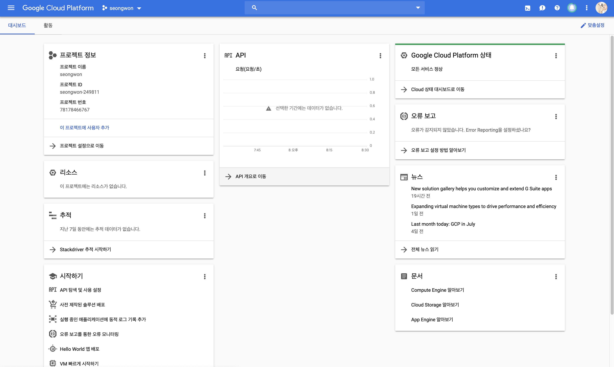
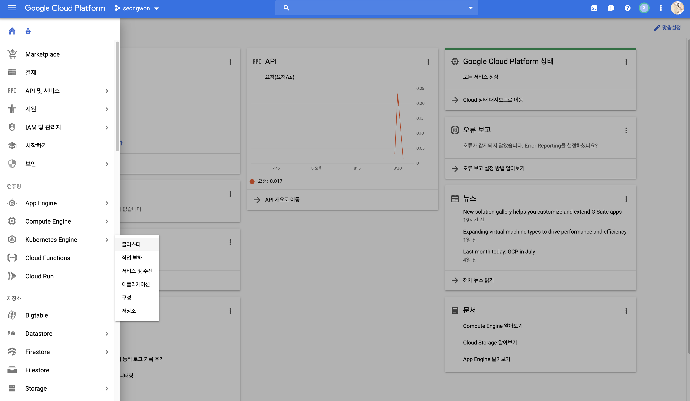
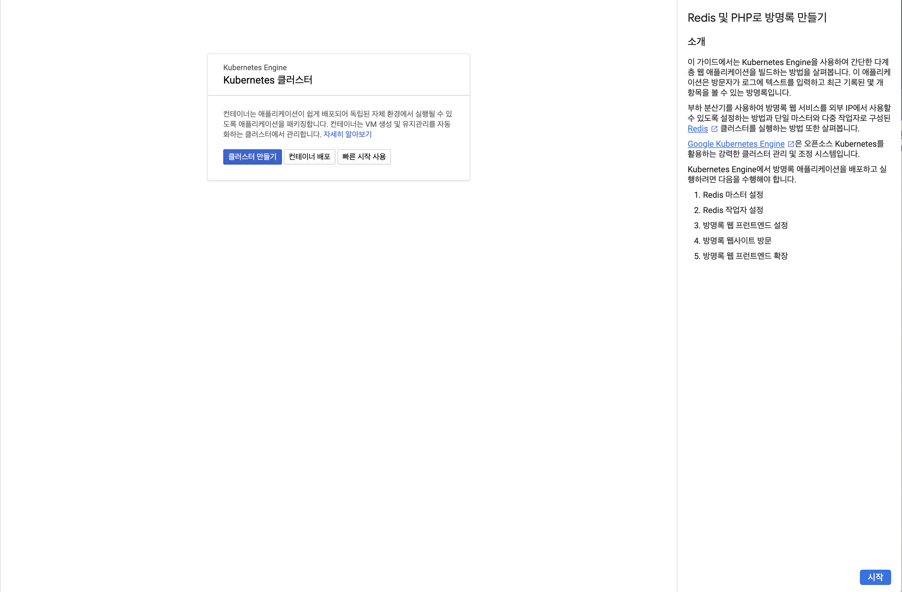
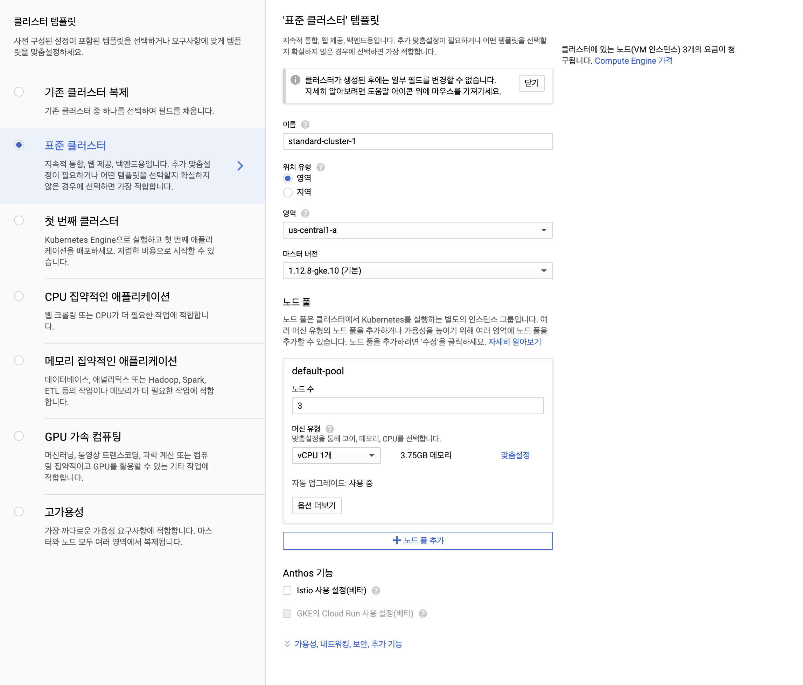

# GCP를 활용한 K8s Application

* GCP는 Google Cloud Flatform으로 아주 간단하면서 다양한 애플리케이션을 실습해서 사용할 수 있다. 

* 최초 가입시 300달러 안에서 12개월 동안 무료로 제공되며, 일부 조건이 충족한다면 평생 무료로 사용할 수 있는 플랜도 있기 때문에 기본적인 테스트 및 개발 용도로는 충분히 사용할 만한 가치가 있다. 

  

  

**NOTICE** 

​	본 문서는 GCP에 공식 Documents에 나오는 내용을 가지고 실습하는 내용이므로, 추가적으로 궁금한 내용이 있다면 [링크](https://cloud.google.com/)을 	클릭하여 내용을 추가적으로 확인할 것을 권장한다. 


### First K8s Application Deploy 

 Google Cloud Flatform에 접속하여 회원가입을 진행하고 프로젝트를 생성하면.  다음과 같은 화면이 나타난다. 

#### 대시보드 생성하기 

 

이후 콘솔화면에서 Kubernetes Engine 페이지로 이동하여 클러스터 탭으로 이동한다. 






#### 애플리케이션 만들기 

간단하게 연습할 것이기 대문에 **클러스터 만들기** 버튼을 클릭하여 Redis 및 PHP를 활용한 방명록을 만들어 볼 것이다. 



표준 클러스터 항목에서 이름과 영역을 선택하고, 만들기 버튼을 클릭하여 클러스터가 생성될 때가지 기다린다. 복합적인 이유에 따라서 생성되는 시간이 달라질 수 있으나 보통 5~7분사이에 클러스터가 만들어 진다. 

위의 템플릿을 살펴보면, 3개의 기본노드가 만들어지며, 싱글 CPU와, 약 4GB 메모리의 성능으로, 그리 높지는 않지만 테스트하기에는 충분한 성능이다. 특히, 온프레미스 환경에서 Kubernetes를 한번이라도 설치해본 사람은 얼마나 쉽고 간단하게 클러스터를 생성할 수 있는지에 대해 감탄할 수 있을 것이다. 

> 온프레미스에서 설치하는 방법은 추후 설명하겠지만 설치 및 구성하는데 굉장히 시간이 많이 걸린다. 
>
> 규모가 크지 않으며, 애플리케이션 위주의 서비스를 운영하며, 퍼블릭 클라우드 사용에 제약이 있다면, Docker Swarm을 사용하는 것이 정신적으로나, 시간적으로 차선책이 될 수 있다. 

콘솔 버튼을을 클릭하여, 웹브라우저에서 터미널 창을 열고 기본 준비를 마친다. 


```bash
$ git clone https://github.com/kubernetes/examples
$ cd examples/guestbook


$ gcloud container clusters list
```

위 명령을 입력하여 샘플코드를 인스턴스에 생성한다. 이후 gcloud 명령을 통해서 클러스터에 대한 정보를 가져오는데 이는 gcloud 및 kubctl 사용자 인증 정보를 설정하기 위함이다. 

```bash
$ gcloud container clusters \
    get-credentials <CLUSTER-NAME> \
    --zone <CLUSTER-ZONE>
    
Fetching cluster endpoint and auth data.
kubeconfig entry generated for standard-cluster-1.
```

**CLUSTER-NAME**은 NAME항목을 적고, **CLUSTER-ZONE**은 LOCATION 항목을 기술한다. 

```yaml
$ cat redis-master-deployment.yaml

apiVersion: apps/v1 #  for k8s versions before 1.9.0 use apps/v1beta2  and before 1.8.0 use extensions/v1beta1
kind: Deployment
metadata:
  name: redis-master
spec:
  selector:
    matchLabels:
      app: redis
      role: master
      tier: backend
  replicas: 1
  template:
    metadata:
      labels:
        app: redis
        role: master
        tier: backend
    spec:
      containers:
      - name: master
        image: k8s.gcr.io/redis:e2e  # or just image: redis
        resources:
          requests:
            cpu: 100m
            memory: 100Mi
        ports:
        - containerPort: 6379
```

redis-master-deployment.yaml 이 파일에는 Redis 마스터를 배포하기 위한 구성이 포함되어 있으며, spec 필드는 복제 컨트롤러에서 Redis 포드를 만드는 데 사용할 포드 사양을 정의한다.  image 태그는 레지스트리에서 가져오게 될 Docker 이미지를 가리킨다. 

```bash
$ kubectl create -f redis-master-deployment.yaml
deployment.apps/redis-master created

$ kubectl get pods
NAME                            READY   STATUS    RESTARTS   AGE
redis-master-57fc67768d-lwphw   1/1     Running   0          38s
```

 마스터 컨트롤러을 배포하고 node 상태를 확인하면 하나의 Redis 노드가 실행하고 있는 모습을 확인 할 수 있다. 


```yaml
$ cat redis-master-service.yaml

apiVersion: v1
kind: Service
metadata:
  name: redis-master
  labels:
    app: redis
    role: master
    tier: backend
spec:
  ports:
  - port: 6379
    targetPort: 6379
  selector:
    app: redis
    role: master
    tier: backend
```

마스터 컨롤러를 배포하고 이번에는 서비스를 생성한다. yaml 파일에서 확인할 수 있듯이 redis-master 서비스를 생성한다. 

````bash
$ kubectl create -f redis-master-service.yaml
service/redis-master created

$ kubectl get service
NAME           TYPE        CLUSTER-IP   EXTERNAL-IP   PORT(S)    AGE
kubernetes     ClusterIP   10.12.0.1    <none>        443/TCP    46m
redis-master   ClusterIP   10.12.2.41   <none>        6379/TCP   3s
````

Redis 마스터가 하나만 존재할 경우 가용성이나 높은 트래픽의 가용성을 충족하지 못할 가능성이 높다. 장애 허용 시스템 (Fault tolerant system)을 만들기 위해서 여러 Redis 복제본을 생성할 것이다. 

```yaml
$ cat redis-slave-deployment.yaml

apiVersion: apps/v1 #  for k8s versions before 1.9.0 use apps/v1beta2  and before 1.8.0 use extensions/v1beta1
kind: Deployment
metadata:
  name: redis-slave
spec:
  selector:
    matchLabels:
      app: redis
      role: slave
      tier: backend
  replicas: 2
  template:
    metadata:
      labels:
        app: redis
        role: slave
        tier: backend
    spec:
      containers:
      - name: slave
        image: gcr.io/google_samples/gb-redisslave:v1
        resources:
          requests:
            cpu: 100m
            memory: 100Mi
        env:
        - name: GET_HOSTS_FROM
          value: dns
          # If your cluster config does not include a dns service, then to
          # instead access an environment variable to find the master
          # service's host, comment out the 'value: dns' line above, and
          # uncomment the line below:
          # value: env
        ports:
        - containerPort: 6379
```

```bash
$ kubectl create -f redis-slave-deployment.yaml
deployment.apps/redis-slave created

$ kubectl get pods
NAME                            READY   STATUS    RESTARTS   AGE
redis-master-57fc67768d-lwphw   1/1     Running   0          9m53s
redis-slave-57f9f8db74-4mlhc    1/1     Running   0          57s
redis-slave-57f9f8db74-xngk4    1/1     Running   0          57s
```

이번 작업까지 완료되었다면. 이번에는 redis-slave 서비스를 생성할 것이다. 

방명록 애플리케이션 데이터를 읽기 위해서 Redis worker와 통신해야 한다. 따라서  Redis worker 검색을 가능하게 하기 위해 서비스를 설정해야 하며, 서비스 포트는 부하 분산을 위해 사용된다. 

```yaml
$ cat redis-slave-service.yaml

apiVersion: v1
kind: Service
metadata:
  name: redis-slave
  labels:
    app: redis
    role: slave
    tier: backend
spec:
  ports:
  - port: 6379
  selector:
    app: redis
    role: slave
    tier: backend
```

본 파일은 6379 포트에서 실행되는 redis-slave 서비스를 정의하며 selector 필드를 통해 이전 단계에서 만든 Redis worker 포트에 대응하게 된다. 

```bash
$ kubectl create -f redis-slave-service.yaml
service/redis-slave created

$ kubectl get service
NAME           TYPE        CLUSTER-IP    EXTERNAL-IP   PORT(S)    AGE
kubernetes     ClusterIP   10.12.0.1     <none>        443/TCP    61m
redis-master   ClusterIP   10.12.2.41    <none>        6379/TCP   14m
redis-slave    ClusterIP   10.12.2.209   <none>        6379/TCP   5m12s
```


#### 방명록 애플리케이션 웹 프런트엔드 설정 

지금까지 방명록 애플리케이션을 위한 Redis 설정을 진행하였으며, 실 사용자가 웹 페이지를 통해 접근할 수 있도록 웹페이지를 생성하고 외부 포트를 맵핑하는 작업을 진행한다. 

```bash
$ kubectl create -f frontend-deployment.yaml
$ sed -i -e 's/NodePort/LoadBalancer/g' frontend-service.yaml
$ kubectl create -f frontend-service.yaml
```

기본적으로 컨테이너 기반의 서비스들은 ClusterIP를 통해 내부적으로 통신하기 때문에 외부에서 접근할 수 없다. 따라서. frontend-service.yaml 파일에서 LoadBalancer 항목을 지정하여, 외부 접속이 가능하도록 설정해야 한다. 

```bash
$ kubectl get services --watch

NAME           TYPE           CLUSTER-IP    EXTERNAL-IP   PORT(S)        AGE
frontend       LoadBalancer   10.12.13.93   <pending>     80:30832/TCP   65s
kubernetes     ClusterIP      10.12.0.1     <none>        443/TCP        64m
redis-master   ClusterIP      10.12.2.41    <none>        6379/TCP       18m
redis-slave    ClusterIP      10.12.2.209   <none>        6379/TCP       8m51s


frontend   LoadBalancer   10.12.13.93   104.197.211.110   80:30832/TCP   95s
```

서비스가 성공적으로 생성되고, 1~2분 정도 기다리게 되면 외부 IP가 노출되며, 이를 통해 웹브라우저로 접속하게 되면 방명록 홈페이지가 나타난다. 


간단하게 GCP를 사용하여 K8s 애플리케이션을 간단하게 제작하였다. 공식 문서를 조금만 읽어본다면 누구나 쉽게 따라 할 수 있기 때문에 이론과 실습을 통해 Kubernetes 감을 익히도록 하자 

만들어진 애플리케이션은 더이상 사용하지 않기 때문에 삭제하여 과금을 막도록 한다. 


